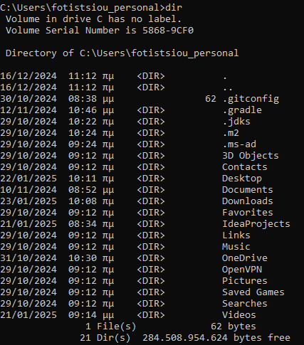

# Command Line Overview

While working on the computer, you need to communicate with the **Operating system** (OS) to get things done for you. For 
example, if you want to open a file, you have to tell the Operating system (Windows, Linux, or macOS) about it. There 
are two ways of interacting with the OS: one is text-based, the other is visual based. Both are important. These two 
methods are the command-line interface and the graphical user interface.

## What is the command line?

The **command-line interface** or **CLI** is a way to interact with an OS via text commands. On the other hand, the
**graphical user interface** or **GUI** provides an interface with many icons and menus. Here, you give commands to the operating 
system by clicking on these icons or menu items.

In the past, command-line interfaces were the only means of interacting with a computer. But why use it now, when you 
have a simple, familiar graphical interface? Well, generally command-line interfaces are much more flexible and have 
more options. For example, you can combine commands to create a new one, while you cannot do that via a graphical 
interface. Some software can even have only a command-line interface, thus requiring its user to know command line 
basics.

Besides, programs executable by the command-line interface can be written in a command language. They are called **shell 
scripts** on UNIX and UNIX-like systems such as GNU/Linux and macOS, and **batch files** on Windows.

All operating systems have command-line interfaces. Applications may have it as well. Also, modern programming languages 
provide an interactive command-line mode, in which you execute code line by line.

## Accessing command-line interpreter

Usually, you don't have to go to the location of the **command-line interpreter** or **terminal** to open it. You can open it by 
simply searching cmd in Windows and terminal in Linux distributions.

If you feel more like an explorer and want to find the location on your own, then try the following paths:
- For Windows 10 or 8 at Start→Windows System→Command Prompt.
- For Windows 7, Vista or XP at Start→All Programs→Accessories→Command Prompt.
- For macOS at Applications→Utilities→Other→Terminal. Some Mac users prefer iTerm2, a replacement for Terminal, because 
  it is slightly more user-friendly. You can find the details on the iTerm official website and install it on your computer.
- For Linux: it depends on your system, but usually, the CLI is located at Applications→Accessories→Terminal or at 
  Applications→System→Terminal. If you don't find it here, just google how to access the command line on your system.

When you open it, you'll see a black (or white) window. If everything is okay, you'll see the **command prompt** where 
you'll be typing your command – an indicator that your computer is ready to accept commands. For Windows, the command 
prompt ends with `>`, while for Linux it's `$`, and for Mac OS it's `$`. To execute a command, type it and then press Enter.

## Learning commands

It's time to learn some important commands. Let's open the command-line interpreter and type some commands. When you open 
it, you will see something similar to the below text.

`C:\Users\name>`

It means that you are in this directory and you can work in the CLI. Now let's try to use it.

Imagine you just woke up on the floor in a room unfamiliar to you. In fact, everything is unfamiliar to you, you don't 
remember anything, not even your name. There's only a computer with the open terminal and this guide, so you decide that 
it might be helpful to figure something out. So, now you will type your command next to this path.

First, type `whoami` and press Enter. Unfortunately, it won't provide you with a deep and satisfying answer about who you 
really are, but you will see something like this:

`desktop-qd7c3ju\shanika`

Good, now you know your name, an imaginary one, at least. As you could already guess, the `whoami` command just returns 
the username you used on your machine. That's why you see the above output.

Next, type `dir` if you use Windows or `ls` if you use Linux or macOS and press Enter. Both of these commands return the 
list of non-hidden files and folders in your current directory. To show the list including hidden files and folders, 
just add an option `-a`, which stands for all. The `ls` command is one of the most widely used ones by developers, especially 
when they work on servers.

If you have Windows, you will see something similar to the image below.

There's no file that is helpful for your situation. Alas!

Isn't there a command to escape? Yes, there's one. Just type exit and you'll be out... of the command-line interpreter 
because this command lets you `exit` it. Good news, you've just learned some useful commands and completed the quest, 
Shanika! Now you can be free.

On the SS64 website, you can find a complete list of commands for Windows, as well as for Linux and macOS