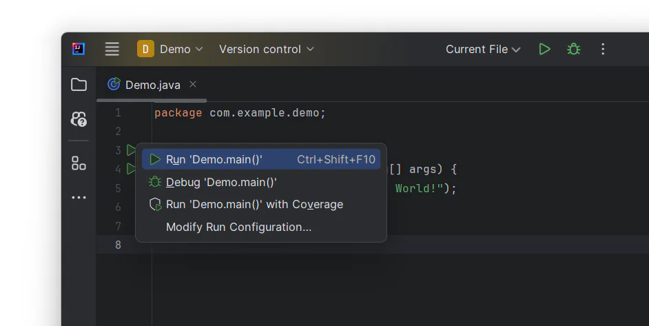
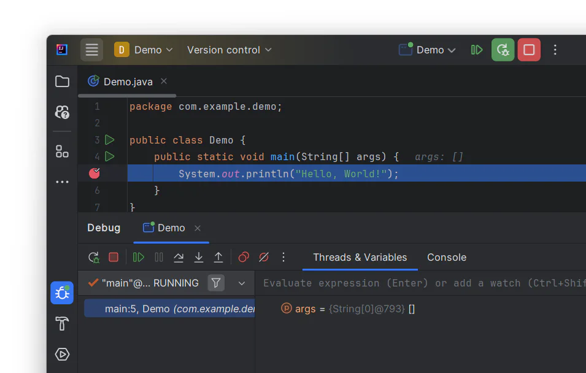
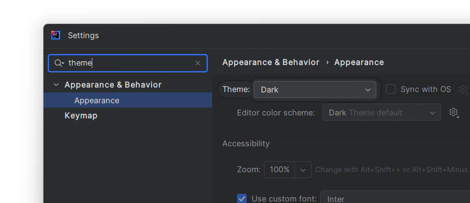
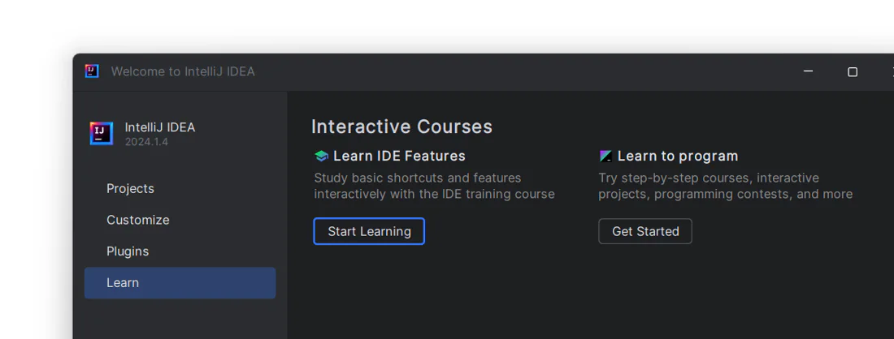

# Run and debug with IntelliJ IDEA

In our previous topics, we covered creating projects and writing programs in IntelliJ IDEA. Now, let's take our skills
further by learning how to run, debug, and customize the IDE. Debugging is a crucial skill for developers, especially in
Java development. IntelliJ IDEA offers a robust set of debugging tools that can significantly boost your productivity
and streamline issue resolution in your code. With these tools, you can efficiently identify and fix bugs, comprehend
complex code, test and verify behavior, collaborate with teammates, and optimize your application's performance. So,
let's continue our journey with IntelliJ IDEA and explore these features.

## Run and debug your application

Let's continue working with the program from the previous topic.

Once your program is ready, you can run it. Then, you can use the debugger to look for potential issues. Let's explore
how these tools work.

### Run:

1. Click on the green triangle Run button in the gutter and select Run 'Demo.main()' in the popup. The IDE will then
   start compiling your code.
   
2. You'll see the result in the Run window that pops up.

### Debug:

1. To test your program using the debugger, first, you need to set a breakpoint. Click on the gutter at the executable
   line of code where you want the breakpoint. Alternatively, you can place the caret on the line and hit ⌘F8 (macOS) or
   Ctrl+F8 (Windows, Linux).
2. To activate the debugger, click on the **Bug** button next to the **Run** button. The **Debugger** window will
   consequently appear with the result.
   

## Customize IntelliJ IDEA

There are many settings that you can configure based on what you want or need.

1. To configure your IDE, select IntelliJ IDEA | Preferences (macOS) or File | Settings (Windows and Linux). For
   example, go to Appearance & Behavior | Appearance and choose different themes. In this topic, we use Darcula.
2. If you want to find something specific in the settings, use the search box as shown below.
   

## Study more features in IntelliJ IDEA

You can continue exploring the IDE with helpful interactive courses right inside IntelliJ IDEA.

1. Select the Learn section on the Welcome screen and click on Start learning. The IDE will open a demo project with
   step-by-step instructions to guide you through all the most prominent features and tools that IntelliJ IDEA offers.
   
