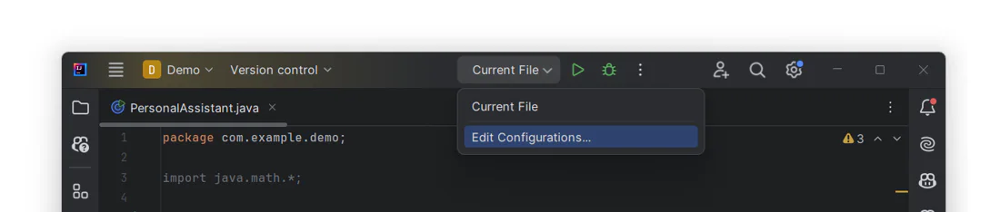
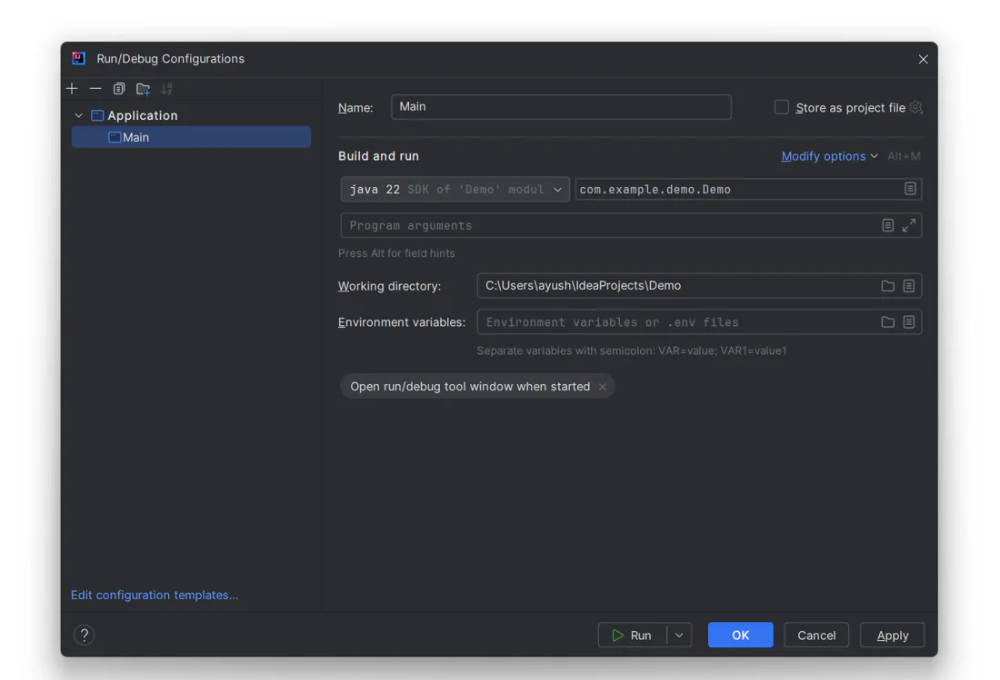
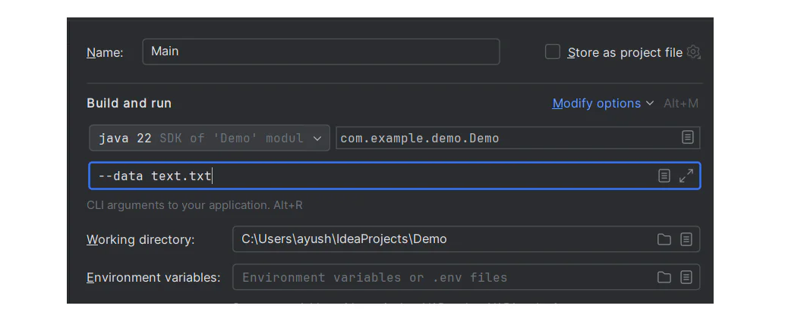

# IntelliJ IDEA run configurations

IntelliJ IDEA uses run/debug configurations to run, debug, and test applications. A run/debug configuration represents a set of startup properties, such as VM or JRE options, that are used to run the program. It also contains information about command-line arguments you pass to the program on startup.

## Run/Debug configurations dialog

The application run/debug configuration enables you to run or debug applications via the main method. To set up a configuration open the Edit Configurations dialog.

The command-line arguments to pass at the startup of the program are configured at the Build and run section in the Program arguments field.

The arguments are passed as a sequence of strings separated by whitespaces. While running a program, the strings would be the command-line arguments passed to its entry points. The delimiters between command-line elements are whitespace characters and the end-of-line delimiter is the newline character.

## Passing arguments in configuration

To pass arguments to a program you should type a list of them in the format you would use on the command line. The whitespaces will be parsed as delimiters, separating one argument from another. These arguments will be passed to the entry point of the program as an array.

It is important to remember, that all of the command-line arguments are passed as strings, so if they are supposed to be treated as, for example, integers, you should convert them explicitly inside the program.

To pass the arguments correctly you should use a list of rules in the following paragraph.

## Rules for passing arguments

When specifying arguments, follow these rules:

- Use spaces to separate individual arguments, for example, --data text.txt.

- If an argument includes spaces, enclose the spaces or the argument that contains spaces in double quotes, for example, some" "arg or "some arg".

- If an argument includes double quotes (as part of the argument), escape the double quotes using backslashes, for example, \"quoted_value\".

For example, if you want to pass two arguments, --data and text.txt, you should insert them as in the following example using the rules above:
