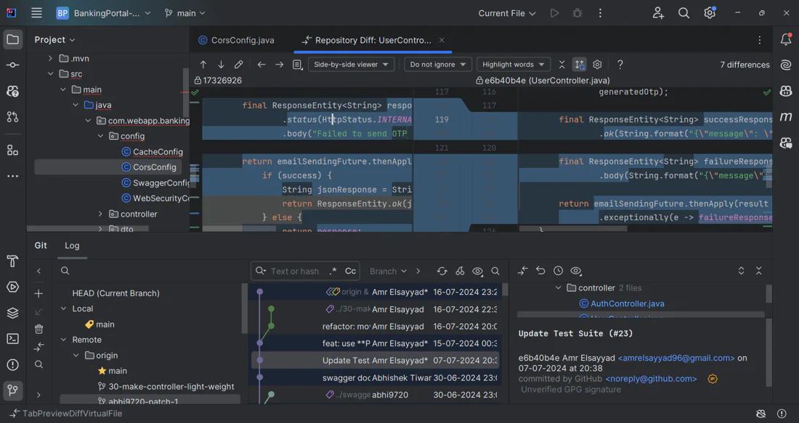
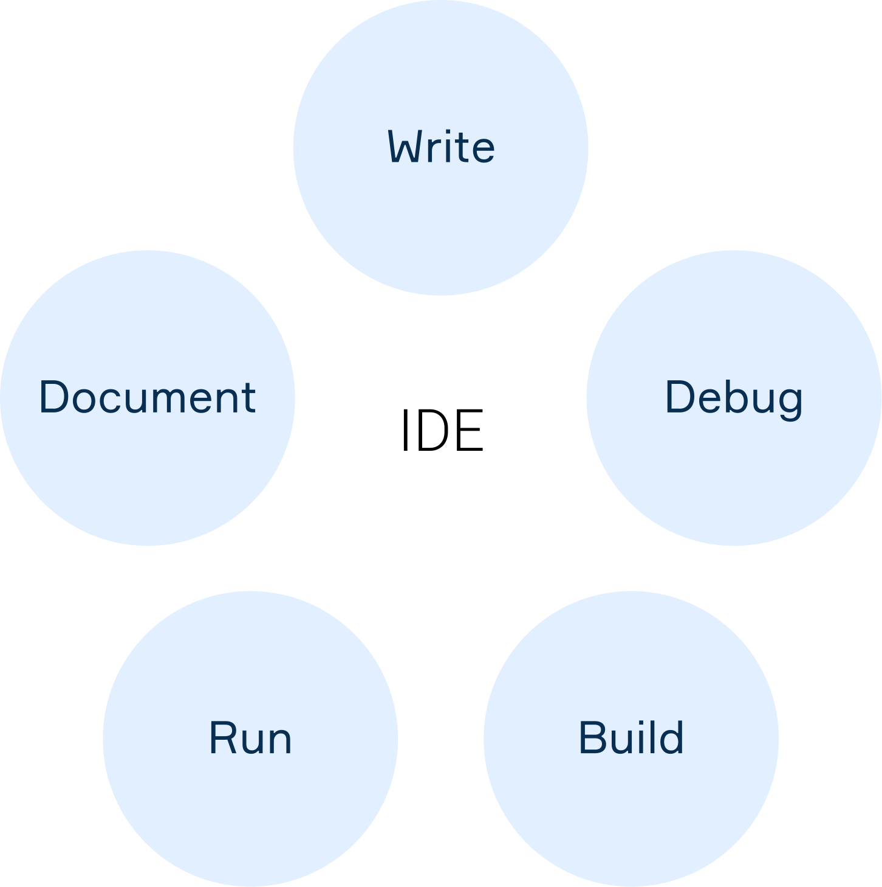

# IDE

Writing just one program involves a whole variety of tasks: you write the code, find and fix errors that inevitably 
arise, then the code has to be compiled, run, and documented. And guess what, all of this has to be done over and over 
again (well, that's just great). With small programs like Hello World, you can perform these tasks using a simple text 
editor to write your source code and a set of tools to translate and start the programs. Some text editors can even 
highlight the syntax, which simplifies the writing process, but this may not suffice for working on something larger 
and more complex.

As a professional developer, you need a specialized tool to navigate through your multiple-file programs, modify, 
compile, run, and debug them, display syntax errors, and so on. An **Integrated Development Environment (IDE)** is precisely 
that: it offers a single program in which developers can deal with all these common tasks.

## Brief historical background

Most modern IDEs are graphical, though the first ones were used back in the era when no one dreamed of graphics. They 
were built on a text-based interface and could only be operated using function keys and hotkeys to invoke various 
functions. 

This was, for example, Turbo Pascal, created by Borland:

The first IDEs were designed to be operated via a console or terminal, which were new in themselves. Indeed, before 
that, programs were generally created on paper and entered into the machine using pre-prepared paper media such as 
punched cards or punched tapes.

Here are some specific historical examples. Dartmouth BASIC was the first language designed to run in a console or 
terminal. This ancient IDE was controlled by commands, not even using menus and hotkeys. However, it did allow you to 
edit source code, manage files, compile, debug, and run programs in a manner fundamentally similar to modern IDEs.

Then it was time for Maestro I. It was a product from Softlab Munich that was the world's first integrated development 
environment for software. Can you believe it held a leading position in its niche for almost twenty years? Today, though, 
Maestro belongs to history.

As you see, humanity did not immediately come to multifunctional IDEs.

## What is a modern IDE?

IDEs were created to maximize programmer productivity through tightly coupled components with simple user interfaces. 
This allows the developer to do fewer steps to switch between different modes, as opposed to discrete development 
programs. However, modern graphical IDEs are complex software packages. That means one can achieve the necessary 
acceleration of the work process only after training. Anyway, there are no big difficulties here either: many IDEs are 
quite interactive, and the interfaces of different manufacturers are often very similar, so it is not too hard to switch 
from one IDE to another.

There are a lot of IDEs for different programming languages. Some support only a single language, while others support 
multiple or can be extended with plugins. For instance, IDEs that support multiple languages are IntelliJ IDEA, Eclipse, 
NetBeans, Android Studio, and Visual Studio Code. IDEs for one specific programming language are Delphi, Dev-C++, IDLE 
for Python, and PyCharm.

As an example, this is what the IntelliJ IDEA IDE looks like:

All of these environments can be run on Windows, macOS, or GNU/Linux.

## IDE components

In general, the development environment includes:

1. A text editor, which is designed to work with text files interactively. It allows you to view the contents of text files 
and perform various actions like inserting, deleting, and copying text, contextual search, replacement, sorting strings, 
viewing character codes and converting encodings, printing. They often contain additional functionality, such as syntax 
highlighting.
2. A translator (compiler and/or interpreter), which translates a text written in a programming language into machine code 
and does this either immediately before starting the program (compilation) or line by line (interpretation).
3. Build automation tools, which get the code ready and put everything together.
4. A Debugger, which looks for errors in the code and immediately reports them.

By and large, using an IDE makes you a more productive developer because an IDE provides tight-knit components with a 
similar user interface. It also automates some routine tasks and even gives you advice and feedback. That's all because 
the purpose of the integrated environment is to combine various utilities into one product. This approach allows 
developers to focus on solving their core problems, while common and standard operations are taken care of by an IDE.