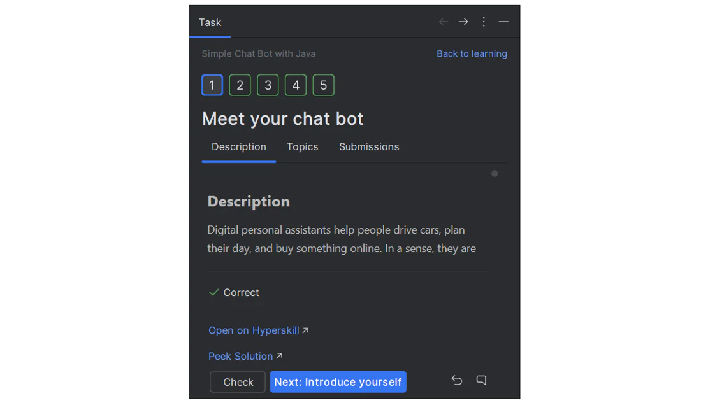
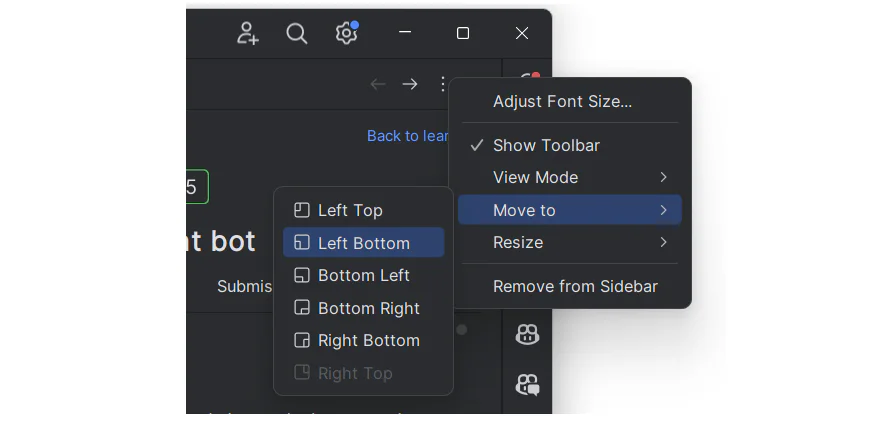
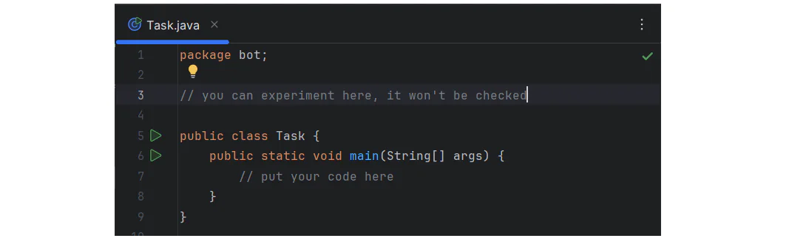

# JetBrains Academy plugin

With Educational Products, you can learn and teach programming languages in the form of coding tasks and custom
verification tests right inside JetBrains IntelliJ Platform-based IDEs. Here you can find a JetBrains Academy plugin and
install it:
[JetBrains Academy Plugin](https://plugins.jetbrains.com/plugin/10081-jetbrains-academy)

When you open your course, you will see the main tool windows: Project View, Task Description, Editor.

## Project View

Project View shows the course syllabus: the list of lessons with lesson steps, or tasks. To navigate to a task, click on
its name.

Note: You can hide the Project View window by clicking on the Project tool button or with the ⌘ 1 / Alt + 1 shortcut.
This will give you more space for the code and task description. Click the Project tool button (or invoke the shortcut)
once again to show the hidden Project View.

## Task Description

The Task Description window gives you all the information you need to complete a programming problem or project stage.

Use Task Description icons for the following actions:

- **Check Task** – Verify if a task assignment is correct for quizzes and programming tasks.
- **Previous Task** / **Next Task** – Navigate between tasks.
- **Reset Task** – Drop all changes and start over.
- **Run Code** – Click the **Run** button on the left side of the editor to execute your code.
    - Shortcut: ⌃ ⌥ R (macOS) / Alt + Shift + F10 (Windows, Linux)
- **View Task Page** – Open the task page on **Hyperskill** and leave a comment.

Task Description needs to be visible, we do not advise hiding it completely. However, you can make it a bit less
distracting by moving it out of the way.

If you work with two monitors, one of the best options is to switch the Task Description panel to the floating mode and
move it to the second monitor or just place it near the main IDE window.

You can do so with the help of a special tool window settings icon.

Or if you prefer you can move the panel to the left, or to the bottom:

## Editor

The Editor is your playground where you will mainly be programming. You can experiment here for the theory tasks and
quizzes without being checked. For programming assignments in the Editor, you will find the code you need to fix, or you
will write your own code from scratch. This code will be checked.

**Run Code:** Click the **Run** icon on the left to execute your code.

Note: If you want to quickly go back to the Editor and focus on your code, the best option is to use the Hide All
Windows command (⌘ ⇧ F12 / Ctrl + Shift + F12). Just invoke it once again to get all the windows back.  
