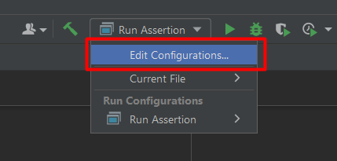

# How To Enable Assert In IntelliJ

> 1. Choose `Run` → `Edit Configurations...`.
> 2. Select the run configuration of interest.
> 3. Click on `Modify options` link and choose `Add VM options`
> 4. Add `-ea` to the `VM options box`.

   