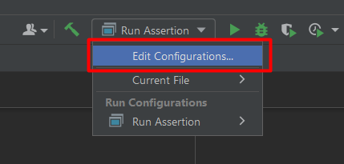
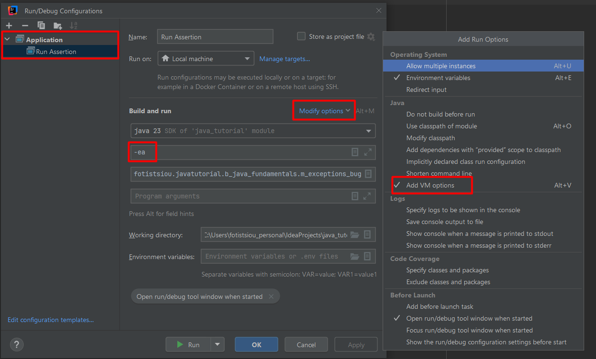

# Debugging Techniques

Debugging is the process of finding and fixing bugs in a program.
The most popular ways that programmers use to debug a program are:

- Logging
- Assertions
- Attaching a debugger

## Logging

One way to track the changes in the program state is to insert additional print statements in the code. When executed,
they will inform you about what's happening under the hood at runtime.

## Assertions

- The assertion is a mechanism that monitors the program state, but unlike additional print statements, it terminates
  the program in a fail-fast manner when things go wrong.
- Fail-fast is an approach when errors that could otherwise be non-fatal are forced to cause an immediate failure, thus
  making them visible.

### How To Enable Assert In IntelliJ

> 1. Choose `Run` → `Edit Configurations...`.
> 2. Select the run configuration of interest.
> 3. Click on `Modify options` link and choose `Add VM options`
> 4. Add `-ea` to the `VM options box`.

## Attaching a debugger

A debugger is a tool that interferes with the normal program execution allowing you to get runtime information and test
different scenarios to diagnose bugs. This is the most popular use of debuggers. However, when you grow more experienced
with them, you'll see that they can be helpful in various situations, not necessarily related to bugs.