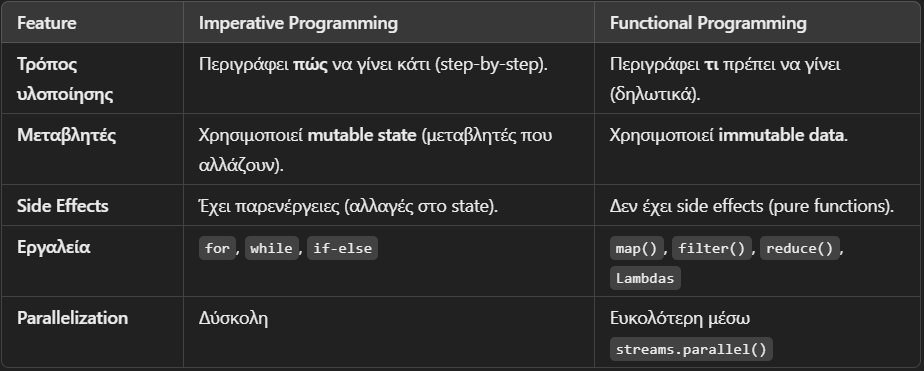

# Functional Programming in Java

## 1. Functional vs. Imperative Programming

### Imperative Programming

- Focuses on *how* a task is executed, describing each step.
- Uses variables that change (*mutable state*) and methods that modify data.
- Often leads to *side effects*.
- Uses loops (*for, while*) and mutable variables.

#### Example (Imperative):

```java
List<Integer> numbers = Arrays.asList(1, 2, 3, 4, 5);
List<Integer> squaredNumbers = new ArrayList<>();

for (int num : numbers) {
    squaredNumbers.add(num * num);
}

System.out.println(squaredNumbers); // [1, 4, 9, 16, 25]
```

### Functional Programming

- Focuses on *what* should be done rather than *how*.
- Uses *immutable data*.
- Relies on *pure functions* (no side effects).
- Based on *streams, higher-order functions, and lambdas*.

#### Example (Functional):

```java
List<Integer> numbers = Arrays.asList(1, 2, 3, 4, 5);
List<Integer> squaredNumbers = numbers.stream()
        .map(n -> n * n)
        .collect(Collectors.toList());

System.out.println(squaredNumbers); // [1, 4, 9, 16, 25]
```

> - No loops
> - We don't change variables




## 2. Lambda Expressions

- A *lambda expression* is a concise way to represent an anonymous class that implements a *functional interface*.
- Syntax:

```java
(parameters) -> { body }
```

- If there is only one parameter, parentheses `()` can be omitted.
- If there is only one statement, curly braces `{}` can be omitted.

### Lambda Expression Example

```java
Function<Integer, Integer> square = x -> x * x;
System.out.println(square.apply(5)); // 25
```

## 3. Closures και Context Variables

### Closures

- A Lambda expression can "capture" variables from its surrounding environment.
- These variables are known as environment variables.
- Environment variables must be either `final` or `effectively final`.

### Example with Effectively Final Context Variable

```java
public class ClosureExample {
    public static void main(String[] args) {
        int number = 10; // Effectively final

        Runnable r = () -> System.out.println(number);

        r.run(); // 10
    }
}
```

> Changing the number after it has been defined is not allowed!

```java
public class ClosureExample {
    public static void main(String[] args) {
        int number = 10;
        number = 20; 

        Runnable r = () -> System.out.println(number); // Compilation Error

        r.run(); // 10
    }
}
```

## 5. Key Points

- Imperative: We change variables and use loops.
- Functional: We use pure functions, streams, and immutable data.
- Lambda Expressions: They allow us to write cleaner and shorter code.
- Closures: Lambdas "capture" variables from their environment, but only if they are effectively final.

### Use Functional Programming when you want:

- Code that is easier to read.
- Avoid side effects.
- Take advantage of streams and parallel execution for better performance.