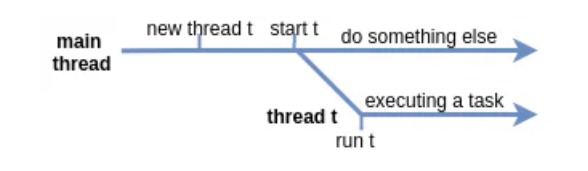

# Concurrency Problems

Here's a picture that explains how a thread actually starts and why it is not happening immediately.

As you may see, there is some delay between starting a thread and the moment when it really starts working (running).

Despite the fact that within a single thread all statements are executed sequentially, it is impossible to determine the
relative order of statements between multiple threads without additional measures.

Because threads run at the same time as other parts of the program, there is no way to know in which order the code will
run. When the threads and main program are reading and writing the same variables, the values are unpredictable. The
problems that result from this are called **concurrency problems**.

To avoid **concurrency problems**, it is best to share as few attributes between threads as possible. If attributes need
to be shared, one possible solution is to use the `isAlive()` method of the thread to check whether the thread has
finished running before using any attributes that the thread can change.