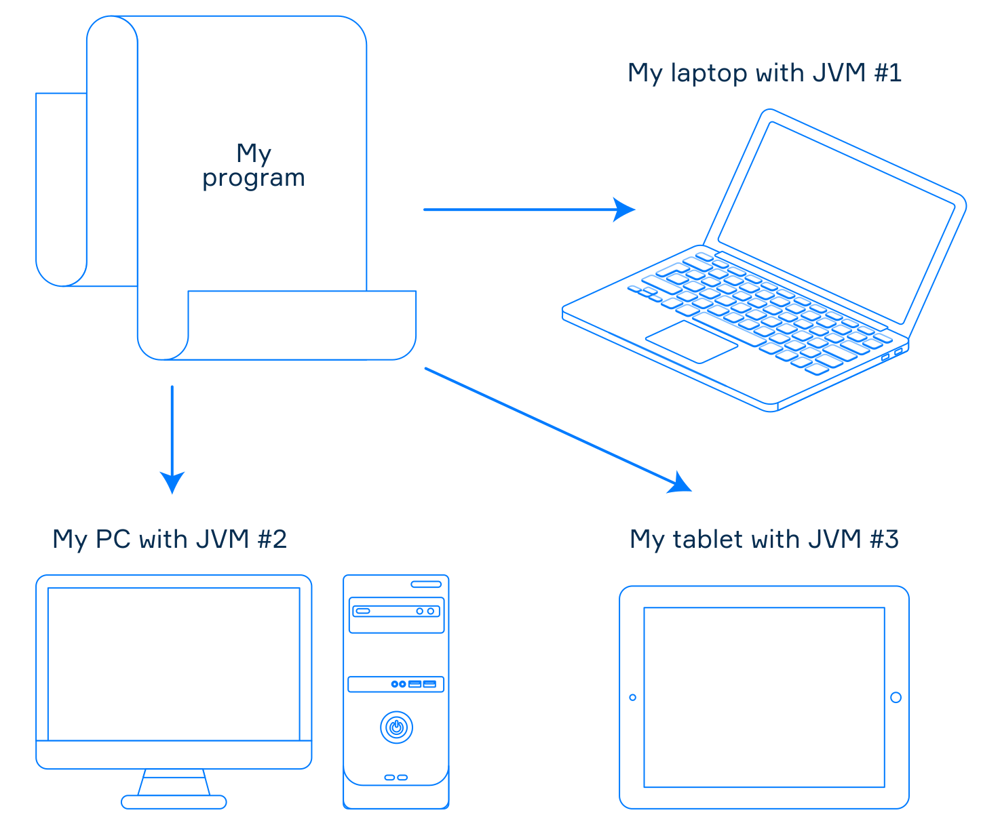
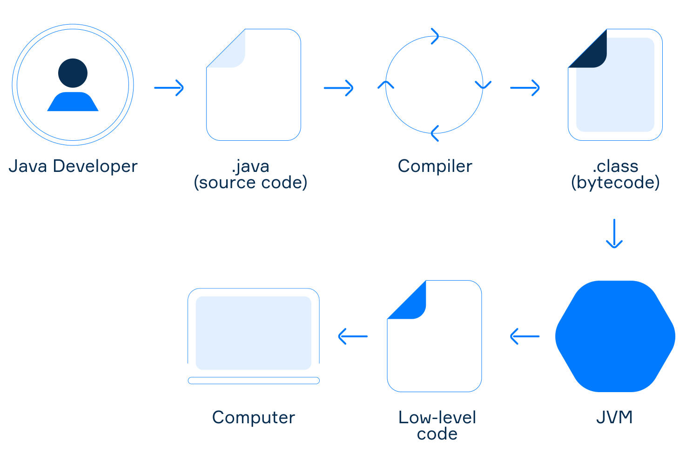
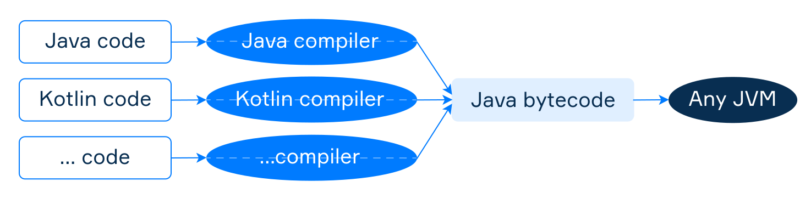

# Write, compile, and run

Even if you are not an experienced programmer, you have probably heard something about Java. It is not only a programming language but also a widely used software platform. In this topic, you will get some essential ideas about the Java platform and learn how to write and run your programs in Java environment.

## Writing a Program

As a developer, the first step in creating a program is writing the source code in a plain text file and saving it with an extension corresponding to the programming language you've chosen (e.g., `.java` for Java, `.kt` for Kotlin). A single program consists of one or more files containing instructions that define what the program does. The **source code** must adhere to the syntax rules of the respective language and should be clear and understandable.

## Compilation

Once the code is written, you need to enable the computer to run the program. Since computers don’t understand source code directly, it needs to be translated into a format they can comprehend. This is where a **compiler** comes in. The code produced after compilation is called native code or low-level code. Different computer platforms use various low-level commands, similar to how people around the world speak different languages, which adds an extra challenge for cross-platform compatibility.

In the Java ecosystem, a compiler (e.g., `javac` for Java or `kotlinc` for Kotlin) translates source code into an intermediate form known as **Java bytecode**, stored in `.class` files. Although computers can’t directly read bytecode, a system called the Java Virtual Machine (JVM) can execute it.

## Running a Program

The **Java Virtual Machine** is an application that acts as a virtual computer according to the JVM specification. It executes the compiled Java bytecode and translates it into low-level commands that the computer understands. Each platform has its own version of the JVM, but since all JVMs follow the same specification, your program will run identically on different devices.

One of the core principles of the Java Platform is "write once, run anywhere." This means a program can operate on various devices, provided they have a JVM installed. This concept is also known as **platform independence** or portability.

> **Important to Remember:** The code input into the JVM is platform-independent, while the output code is platform-dependent.

*A Platform-Independent Program in the World of Java*

If the JVM is installed on a computer, you can run a compiled JVM program using the `java` tool. This tool opens a file with the `.class` extension to launch the program, making it compatible across various platforms, as the JVM handles translation into the specific commands required by the device. This approach enables developers to "write once, run anywhere," a core benefit of JVM languages.

*The picture briefly summarizes the work cycle of a JVM program.*

## JVM languages

The Java Platform allows using more than one programming language to create programs. This is achieved by the design of the JVM: it doesn't know anything about any particular programming language. It only understands Java bytecode. If the tools for a programming language can generate bytecode, programs written in this language can be executed on the JVM. Such languages are often called **JVM languages**. They include Java itself, Kotlin, Scala, Groovy, Clojure, and others. So, to create programs in the world of Java, you can choose the most convenient language of your choice.

> Nowadays, you can find tools to generate Java bytecode for almost any programming language, which means that there's hardly any language that is not a JVM language.

*Different programming languages can be used to write programs in the world of Java*