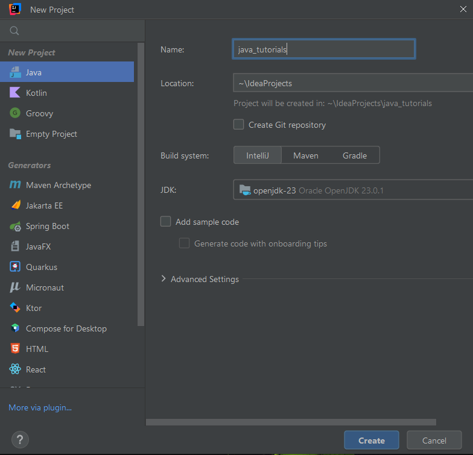

# Create a Java Project with IntelliJ IDEA
1. Install IntelliJ IDEA on your computer and launch it.
2. If no project is currently open in IntelliJ IDEA, click on New Project in the Projects section on the Welcome screen. 
   Otherwise, select File | New | Project.
3. In the New Project wizard (left column), select the Java language.
4. Name the new project (e.g. java_tutorial).
5. Select the location that the new project will be created (e.g. ~\IdeaProjects).
6. Select the build system that you want to use in your project (e.g. IntelliJ).
7. From the JDK list, select or add the JDK that you want to use in your project.
8. Disable the 'Add sample code' option.
9. Create a new package in the src folder (e.g. fotistsiou.javatutorial.fundamentals)
10. Write your code.

